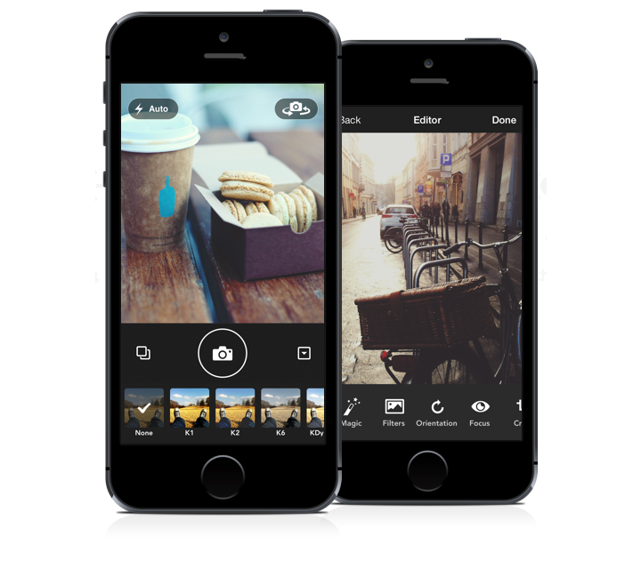

<p align="center"></p>

<h1 align="center">img.ly SDK for iOS</h1>

<p align="center">

<a target="_blank" rel="noopener noreferrer" href="https://github.com/ky1vstar/imgly-sdk-ios-2/actions?query=workflow%3ACI"></a>
<a href="#cocoapods"></a>
<a href="#carthage"></a>
<a href="#swift-package-manager"></a>
</p>

img.ly SDK for iOS is a Cocoa Touch framework for creating stunning images with a nice selection of premium filters.

## Foreword

This project was [originally](https://github.com/chenzeyu/imgly-sdk-ios) created by [@9elements](https://twitter.com/9elements). Since it was compatible only with Swift 2 I've decided to convert it to modern Swift syntax and share it with you.

| imglyKit2 version | Swift version |
|:-----------------:|:-----------------:|
| 1.1.0 - 1.3.0 | 5 |
| 1.0.0 | 4 |

### Overview

img.ly SDK provides tools for creating photo applications for iOS with a big variety of filters that can be previewed in real-time. Unlike other apps that allow a live preview of filters, the img.ly SDK even provides a live preview when using high-resolution images.

### Features

* 40 stunning build in filters to choose from.
* Open source, need anything? Want to change anything? Go ahead, we provide the full source code.
* Native code. Our backend is Core Image based, therefore we dodge all the nasty OpenGL problems other frameworks face. Also its easier to add new filters. Just derive from `CIFilter` override the `outputImage` imageproperty and you are good to go.
* iPad support.
* Design filters in photoshop! Before you had to tweak values in code or copy & paste them from photoshop or your favorite image editor. With our response technology that is a thing of the past. Design your filter in photoshop, once you are done apply it onto the provided identity image. That will 'record' the filter response. Save it, add it as new filter, done!
* Swift. Keeping up with time, we used Swift to code the img.ly SDK, leading to leaner easier code.
* Filters can be previewed in the camera preview.
* Low memory footprint.
* Non-destructive. Don't like what you did? No problem, just redo or even discard it.
* In addition to adding beautiful filters to your photos, you can now also record videos and add the same filters.



## Requirements

* Xcode 10.0
* Swift 5.0
* iOS 9.0+
* macOS 10.10+

## Installation

### CocoaPods

imglyKit is available through [CocoaPods](http://cocoapods.org). To install
it, simply add the following line to your Podfile:

```bash
pod 'imglyKit2'
```

### Carthage

[Carthage](https://github.com/Carthage/Carthage) is a decentralized dependency manager that builds your dependencies and provides you with binary frameworks.

To integrate imglyKit into your Xcode project using Carthage, specify it in your `Cartfile`:

```ogdl
github "ky1vstar/imgly-sdk-ios-2"
```

Run `carthage update` to build the framework and drag the built `imglyKit.framework` into your Xcode project. 

On your application targets’ “Build Phases” settings tab, click the “+” icon and choose “New Run Script Phase” and add the Framework path as mentioned in [Carthage Getting started Step 4, 5 and 6](https://github.com/Carthage/Carthage/blob/master/README.md#if-youre-building-for-ios-tvos-or-watchos)

### Swift Package Manager

To integrate using Apple's [Swift Package Manager](https://swift.org/package-manager/), add the following as a dependency to your `Package.swift`:

```swift
dependencies: [
    .package(url: "https://github.com/ky1vstar/imgly-sdk-ios-2.git", from: "1.3.0")
]
```

Alternatively navigate to your Xcode project, select `Swift Packages` and click the `+` icon to search for `imgly-sdk-ios-2`.

## Structure

The SDK can be divided into two parts, frontend and backend.
We also provided an instance factory that handles the object generation for you.
Its class is called `IMGLYInstanceFactory`. It has a property called `sharedInstance` that 
uses the singleton pattern, so it doesn't need to be created every time.
Beside the views and view controllers, it also has methods to create the different filters, and the photo processor described below.

## Frontend

The frontend part of the SDK contains all the views and view controllers, or generally speaking the UI. The frontend itself consists of two parts. Camera related UI and filter or operation related UI.

For the camera UI there is the `IMGLYCameraViewController`. That controller shows a camera live stream, a filter selector, and controls to operate the camera settings such as flash, front camera or back camera. You have to instantiate the `IMGLYCameraViewController` with the recording modes that you want to make available, currently `.Photo` and `.Video` are supported.
After a photo has been taken the `IMGLYCameraViewController` calls the handed over completion handler, or if none is set, it presents a `IMGLYMainEditorViewController` within a `IMGLYNavigationController` modally. 
After a video has been taken the `IMGLYCameraViewController` call a completion block with the URL to the generated video file.

The `IMGLYMainEditorViewController` functions as main editor. It is connected to sub editors that allow the user to edit an image. The built-in sub editors are Magic (automatic image enhancement), Filter, Stickers, Orientation (Flip / Rotate), Focus (Tiltshift), Crop, Brightness, Contrast, Saturation, and Text. 
These dialogs use a lower resolution image as a preview to improve the performance.
When the user presses the done button of the main editor, the chosen settings are applied to the full resolution image.
The `IMGLYMainEditorViewController` can be used without the `IMGLYCameraViewController` like so:

```swift
func callEditorViewController() {
    var editorViewController = IMGLYMainEditorViewController()
    editorViewController.highResolutionImage = image
    editorViewController.initialFilterType = .none
    editorViewController.initialFilterIntensity = 0.5
    editorViewController.completionBlock = editorCompletionBlock
}

...

func editorCompletionBlock(result: IMGLYEditorResult, image: UIImage?) {
    ...
}
```

### Fixed Filter Stack

The `IMGLYPhotoProcessor` allows to apply any list of filters to an image.
In order to make the process easier and non-destructive, all the editor view controllers 
use a fixed filter stack. That means that the order of the filters is immutable and
the user just sets the parameters for the distinct filters.
The input is always the originally taken image and the output image contains all the changes made.

### Adding a custom editor

You can easily create your own sub editors by subclassing `IMGLYSubEditorViewController`. The main editor automatically passes a deep copy of the fixed filter stack, a low resolution image, and a completion handler to each sub editor. Each subclass also has an `UIImageView` called `previewImageView` that is used to present the preview image and an `UIView` called `bottomContainerView` that you can use to present your own controls. Within your subclass you should modify the passed `fixedFilterStack` and update the preview image whenever necessary by using `updatePreviewImageWithCompletion(completionHandler:)`. Finally, if the user taps the Done button, the updated fixed filter stack is passed back to the main editor, if the user taps the Cancel button, the updated fixed filter stack and simply discarded. You also have to add a new `IMGLYActionButton` to the `actionButtons` property of `IMGLYMainEditorViewController`.

The img.ly SDK comes with an example app to demonstrate the simplicity and power of the SDK. 

## Backend

The backend takes care about the actual image manipulation. The `IMGLYPhotoProcessor` is the main class, its `processWithCIImage` / `processWithUIImage` methods take an image and an array of `CIFilter` objects and apply the filters to the given image sequentially.

The following code filters an image with the steel filter.

```swift
let filter = IMGLYInstanceFactory.sharedInstance.effectFilterWithType(.steel)
let filteredImage = IMGLYPhotoProcessor.processWithUIImage(image, filters: [filter])
```

### Response Filters

These enable you to create filters in programs such as photoshop. The main idea behind them is to take an image that represents the identity function, for the colors in an image, and apply effects on that image.
The resulting image represents the response of the colors to the effect.
To use the filter in you project you need to:

* Apply the desired modifications to this image <br />  <br />


* Add the resulting image to the `Filter Responses` group in the project. Note: the image must be saved in PNG format.
* Create a new class that derives from `IMGLYResponseFilter`.
* Add a init method that sets the `responseName` property to the filename of the added image.
* Add a new type to `IMGLYFilterType`.
* Add a new case to the `effectFilterWithType` method in the instance factory.
* Add the new type to the available filters list. 

The framework will take care about the rest, such as preview rendering.
Here is an example of a response filter

```swift
class IMGLYSteelTypeFilter: IMGLYResponseFilter {
    override init() {
        super.init()
        self.responseName = "Steel"
        self.imgly_displayName = "steel"
    }

    required init(coder aDecoder: NSCoder) {
        super.init(coder: aDecoder)
    }

    override var filterType: FilterType {
        return IMGLYFilterType.steel
    }
}
```

### Choose available filters

As the example app demonstrates we added MANY filters to choose from.
To select a set of filter change the `availableFilterList` method of the instance factory.
It simply returns an array of filter types. Those will be used inside the framework. 

### License

Please see [LICENSE](https://github.com/ky1vstar/imgly-sdk-ios-2/blob/master/LICENSE) for licensing details.


### Author

9elements GmbH, [@9elements](https://twitter.com/9elements), [http://www.9elements.com](http://www.9elements.com)
